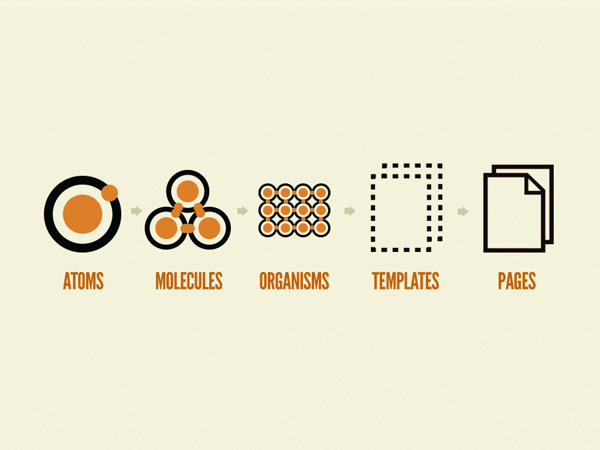

# 1. TDD

### 학습 키워드

* TDD란
* Jest
* Describe - Context - It 패턴
* 단위테스트란


## TDD

TDD는 Test Driven Development의 약자로 '테스트 주도 개발'이라고 한다.

반복 테스트를 이용한 소프트웨어 방법론으로, 작은 단위의 테스트 케이스를 작성하고 이를 통과하는 코드를 추가하는 단계를 반복하여 구현!

### TDD 개발주기

<figure><figcaption></figcaption></figure>

**Red** - 실패하는 테스트 코드를 작성

**Green** - 테스트 코드를 성공시키기 위한 실제 코드 작성

**Refactor** - 중복코드를 제거하는 등의 리펙토링 수행

* 이를 통해 실체 코드에 대해 기대되는 바를 명확하게 할 수 있고, 불필요한 설계를 줄일 수 있다.


## Jest

Jest는 페이스북에서 개발한 테스팅 라이브러리로, 자바스크립트 기반의 테스팅에 사용된다.

#### More

페이스북에서는 Jest를 단순한 테스팅 라이브러리가 아닌 “테스팅 프레임워크”라고 부르는 만큼 기존 자바스크립트 테스팅 라이브러리와는 차별점이 있다. Jest 이전에는 자바스크립트 코드를 테스트하라면 여러 가지 테스팅 라이브러리를 조합해서 사용하곤 했었다. 예를 들어, Mocha나 Jasmin을 Test Runner로 사용하고, Chai나 Expect와 같은 Test Matcher를 사용했으며, 또한 Sinon과 Testdouble 같은 Test Mock 라이브러리도 필요했었다. 하지만 Jest는 라이브러리 하나만 설치하면, Test Runner와 Test Matcher 그리고 Test Mock 프레임워크까지 제공해주기 때문에 상당히 편리하게 느껴진다.


### Jest 기본문법

```javascript
describe('계산 테스트', () => {
   const a = 1, b = 2;

   test('a + b는 3이다.', () => {
      expect(a + b).toEqual(3);
   });
});

/*
describe('그룹 테스트 설명 문자열', () => {
   const a = 1, b = 2; // 테스트에 사용할 일회용 가짜 변수 선언

   test('개별 테스트 설명 문자열', () => {
      expect(검증대상).toXxx(기대결과);
   });
});
*/

```

* **describe() -** 테스트 그룹을 묶어주는 역할을 하고, 그 안에 콜백 함수 내에 테스트에 쓰일 변수, 객체들을 선언하여 일회용으로 사용 할 수 있다.
* **toXxx() -** Test Mathcher라고 하며, 결과 값과 비교할때 사용된다.
* **test() -** 테스트 코드를 돌리기 위한 하나의 단위를 뜻한다.
* **expect() -** 테스트에 사용될 함수 등의 내용을 입력한다.


### 테스트 케이스를 정의하는 방법

* test함수로 개별 테스트를 나열하는 방식
* BDD(Behavior Driven Development)스타일로 테스트를 조직화 하는 방식

### 개별 테스트 나열

```javascript
test("add", () => {
  expect(add(1, 2)).toBe(3);
});
```

### Describe - Context - It 패턴

* Describe : 설명할 테스트 대상
* Context : 테스트 대상이 놓인 상황 설명(with 또는 when으로 시작하도록 한다.)
* it  : 테스트 대상의 행동을 설명

BDD(Behavior Driven Development) 테스트 코드 작성 패턴인 Given-When-Then 스타일과 비슷하지만 테스트 대상의 행동을 더 자세하게 설명하는 패턴이다.

### add 함수 예시

```javascript
function add(...numbers: number[]): number {
  if (!numbers.length === 0) {
    return 0;
  }
  if (numbers.length === 1) {
    return numbers[0];
  }
  if (numbers.length === 2) {
    return numbers[0] + number[i];
  }
  if (numbers.length === 3) {
    return add(numbers[0], numbers[1]) + numbers[2];
  }
}

const context = describe;

test("add", () => {
  expect(add(1, 2)).toBe(3);
});

// add 메서드가 테스트 대상임(함수명)
describe("add", () => {
  //테스트 대상이 놓인 상황(인자의 개수)
  context("with no argument", () => {
    // 테스트 대상의 행동(리턴값)
    it("return zero", () => {
      expect(add()).toBe(0);
    });
  });

  context("with only one argument", () => {
    it("returns the same number", () => {
      expect(add(2)).toBe(2);
    });
  });

  context("with two arguments", () => {
    it("return sum of two numbers", () => {
      expect(add(1, 2)).toBe(3);
    });
  });

  context("with three arguments", () => {
    it("returns sum of three numbers", () => {
      expect(add(1, 2, 3)).toBe(6);
    });
  });
});
```

Jest + TypeScript에서`jest.config.js`작성

```javascript
//jest.config.js
module.exports = {
  testEnvironment: 'jsdom',
  setupFilesAfterEnv: [
    '@testing-library/jest-dom/extend-expect',
  ],
  transform: {
    '^.+\\.(t|j)sx?$': ['@swc/jest', {
      jsc: {
        parser: {
          syntax: 'typescript',	
          jsx: true,
          decorators: true,
      },
      transform: {	
          react: {
            runtime: 'automatic',
          },
      },
    },
    }],
  },
};
```

## 테스트 피라미드

테스트는 범위 별로 단위 테스트, 통합 테스트, 사용자 테스트(end-to-end)로 나뉜다.

* 단위 테스트(unit test) : 함수, 모듈, 클래스
* 통합 테스트(integration test) : 모듈들, 클래스들
* E2E 테스트(end-to-end) : 사용자 테스트, UI 테스트

피라미드의 위쪽으로 올라갈수록 테스트 비용이 올라가고 테스트 속도가 느리다.

단위 테스트를 작성하는 것이 가장 싸고 쉽고 속도도 빠르므로 많이 작성하는 것이 좋다.

그래야 더 빠르게 내 코드에 문제가 없는지 피드백할 수 있기 때문이다.

## 단위 테스트

> 단위 테스트는 응용 프로그램에서 테스트 가능한 가장 작은 소프트웨어를 실행하여 예상대로 동작하는지 확인하는 테스트이다.

단위 테스트는 일반적으로 함수, 메서드, 클래스 수준을 테스트하는 것이다. 어떤 기능이 실행되면 어떤 결과가 나온다 정도로 테스트를 진행한다.

### 단위 테스트 작성의 필요성

단위 테스트는 애플리케이션의 작은 부분만 독립적으로 테스트 하므로 빠르게 문제 여부를 확인할 수 있다.

그리고 사실 테스트 코드를 통해 문서화도 가능하다 !

모든 함수에 대해 단위 테스트를 진행하므로 테스트 코드를 잘 작성하는 것만으로 개발자의 의도를 더욱 명확히 알 수 있다.

## 좋은 테스트란?

> 📌 **F (Fast) I (Isolated) R (Repeatable), S (Self - Validating), T (Timely)**

좋은 테스트의 FIRST 법칙이 있다.

**Fast**: 실행 속도가 빨라야 한다. 느린 것에 대한 의존성 낮추어야 한다. 예를 들어 파일, 데이터베이스, 네트워크 등 실행 속도를 느려지게 하는 부분에서 mock 함수를 사용하면 좋다

**Isolated** : 독립적이고 집중적으로 유지해야 한다.

**Repeatable** : 코드가 변하지 않았다면 테스트 결과는 항상 동일 해야 한다. 다른 테스트 코드에 의존하거나 네트워크에 의존하면 좋지 않다. 환경에 영향을 받지 않도록 작성하는 것이 좋다.

**Self - Validating** : 스스로 결과를 검증하기

**Timely** : 시기적절하게 테스트 코드 작성하기

이외에도 버그를 찾을 수 있어야 하고 테스트 결과에 일관성이 있으며 의도가 명확히 드러난 테스트 코드가 좋은 테스트이다.

